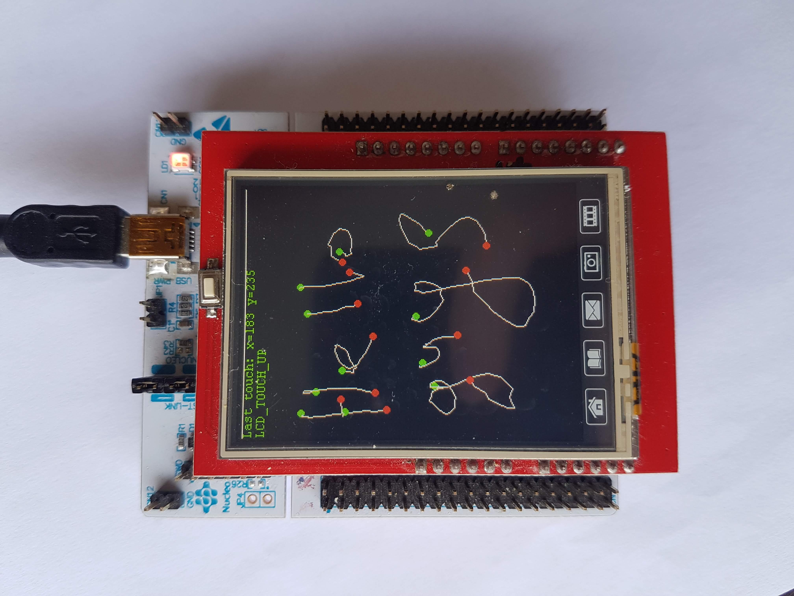

# ILI9341 TFTLCD Touch Screen driver

The [lcd-touch](display/lcd_touch.h) library should work with any STM32 board that has a compartment (slot) for TFT LCD shield\*. The rest of the project provides an example of how to use the lcd-touch lib on Nucleo F446RE. If your driver is different from ILI9341, refer to [`lcd.h`](display/lcd.h).

\*TFT Shield: 2.4 Inch TFT LCD Shield ILI9341 HX8347 240x320 Touch Board 65K RGB (~$7).

**The interface is not SPI**: instead, the communication with the LCD is done by acting directly on GPIO Pins and therefore is faster than an SPI alternative implementation, which you could probably find somewhere else.

### LCD Touch pinout

 *   Y- PB10
 *   Y+ PA4, EXTI4
 *   X- PA1
 *   X+ PA8

In idle state, PA4 is in interrupt mode awaiting for touches. You can't draw and await for touches simultaneously.

### Measuring X-pos

* set PA1 to logical 0
* set PA8 to logical 1
* set PB10 in input mode
* set PA4 in analog mode
* get value from ADC2 channel 4


### Measuring Y-pos

* disable EXTI4 line
* set PB10 to logical 0
* set PA4 to logical 1
* set PA8 in input mode
* set PA1 in analog mode
* get value from ADC1 channel 1
* clear EXTI4 line pending interrupt
* enable EXTI4 line


### How to use
```c
// initialize ADC1 & ADC2

LCD_Init();
LCD_Touch_Init(&hadc2, ADC_CHANNEL_4, &hadc1, ADC_CHANNEL_1);
LCD_SetMode(LCD_MODE_TOUCH);
LCD_TouchPoint p;

while (1) {
    if (LCD_Touch_Read(&p) == LCD_TOUCH_READ_SUCCESS) {
        // draw the last stroke, for example
        LCD_Touch_Draw_ConnectLastPoint(&p);

        // do whatever you want with the touch point `p`
        ...
    }
}
```

`LCD_TouchPoint` is a struct that holds X and Y position, time, and touch state that can be one of `LCD_TOUCH_DOWN`, `LCD_TOUCH_MOVE`, or `LCD_TOUCH_UP`.

Note. Optimization flags other than None are unstable at the moment.


### Notes on IDE

The project was originally written in SystemWorkbench, then converted to TrueAtollicStudio to become eventually suppressed by STMCubeIDE.

OS: Ubuntu 18.04

If you're unable to open/convert the project in one of the listed above IDEs, open an issue.


### Demo on YouTube

[](https://youtu.be/2-NuPZo1CeQ)
